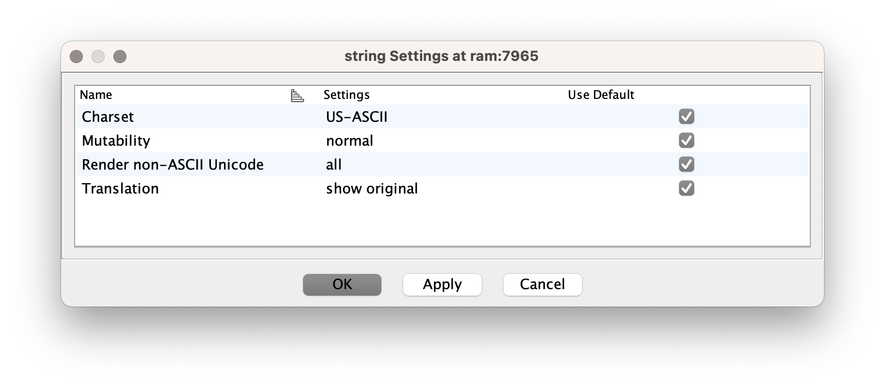

# Java-Ghidra-EightBit-Charsets
Patch for [Ghidra](https://github.com/NationalSecurityAgency/ghidra) to show text in ZX81, Commodore and other vintage computers encodings.
## Installation
Get the latest release from the releases page and copy the jar file to the `Ghidra/patch/` folder. 
Then, restart Ghidra and you will see the new encodings in the export dialog. Or build the jar manually.
## Usage
In Ghidra mark data block as string and then select context menu 'Data'->'Setting' and choose the desired encoding.
<figure></figure>
<figure></figure>

